# This is a code for 3D reconstruction of wings.  
Bug 1: When generating/regenerating new frames, all data is refreshed, which makes the hull reconstruction error
something need to be fixed after ```initialize directory``` and ```initialize(root, fly)```.
  
Because Bug 1 can cause a huge problem when running the code accidentally, the code now is temporally separated into two '.m' files.
The ```run_mask.m``` is to create masks for a video only, ```run_main.m``` is for hull reconstruction. 

Bug 2: Colors flip at ```analyze the hull``` in ```run_main.m```. Left wing should be blue but it shows red, the same issue with right wing.

# create mask for a new video
1. Open run_mask.m

2. Under ```Load the DLT coeffs 7 backgrounds, set video directories```:  
2.1 ```root```: the directory where your 'fly_#' is.  
2.2 ```fly```: the fly number of the fly is to be analyzed.  

3. Edit the parameters under ```tracking start and end index```  

4. Under ```initialize directory```:  
After running ```initialize(root, fly)```:  
4.1 Choose 3 videos of the fly needs to be analyzed (from the root and fly number).  
4.2 Choose click 3 background videos of the fly needs to be analyzed (from the root and fly number) 
with the same order when choosing the 3 videos in ```3.1```   
4.3 Drag from the center of the body to the end of the pin along the pin 3 hit 'Space' when done (3 times).  
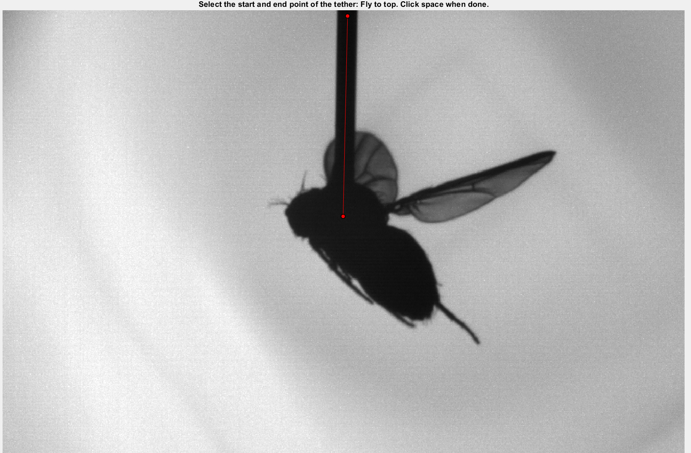
4.4 Crop the images and leave enough space for all yaw angles (reach the end of the pin). double click the box when done (3 times).  
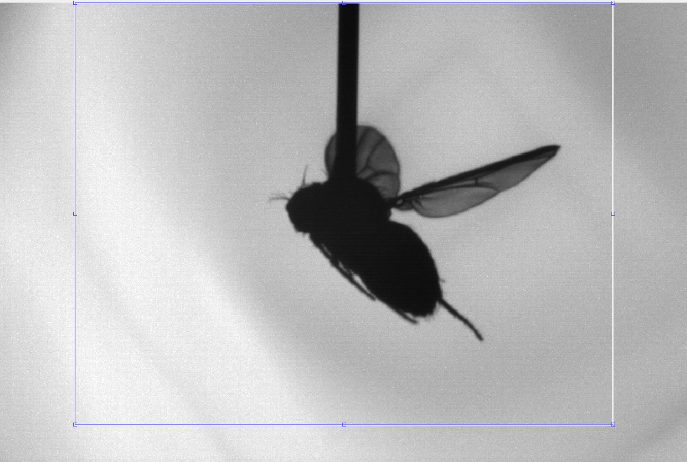  

5. Run until ```Initialize voxel range and reconstruction resolution (reduces computational requirement)```:  
Click and select the space covers the whole fly and tether. Double click to link end and start points. 
Double click inside the space to start the next. 3 times (do not click outside of the figures)  

6. Under ```consider turning this into a sep function``` & ```Find the body 3D reconstruction and heading``` & ```Wing 3D reconstruction```:  
If the vector is not point out of the head (i.e.: direction from body to head), flip the vector; otherwise, do nothing.
There may be some error from ```5``` that rises an error at ```6```. Just repeat ```5``` until no error happens. (Good luck)

# do hull reconstruction
1. Open run_main.m  

2. Under ```Set mask data directories```:
2.1 ```root```: the directory where your 'fly_#' is.  
2.2 ```fly```: the fly number of the fly is to be analyzed.  

3. Edit ```initialized directory and voxel_size```  

4. Run the code under ```Split left and right wing```  

5. Under ```UI error detection```:   
If the wing shape is not correct, type 'y' in the command window, hit 'Enter' for the next frame.
(normally 'y' for all)  

6. Run code under ```find stroke reversal```   

7. Under ```UI correction for those pesky large wings (important at stroke reversals)```:  
7.1 Normally just need to edit the frames in ```CorrectForLargeWingsV6(init,frames,flag_stroke_reversal,voxel_size)```  
i.e.: ```CorrectForLargeWingsV6(init,7101:7120,zeros(length(flag_stroke_reversal),1),voxel_size)```  
7.2 Select the wings by click the edges of the wings. First 3 figures for the left wing, the next 3 figures for the right wing. Double click to connect the end and start points. Double click for the next.
Guess for the hidden parts. 
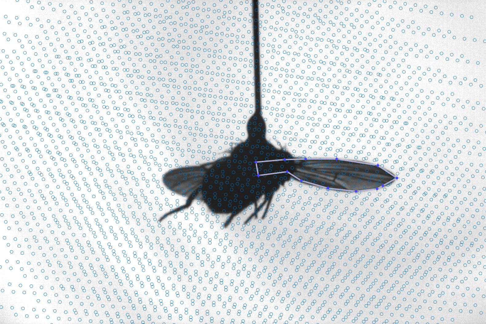  
Hints: For frame 1 and 2, higher tip is the higher tip; smaller wing for 1 is the larger wing for 2. For frame 1 and 3, wings are at the same side of the screen.  
7.3 Select leading edge: only purple area matters. Leading edge is the front edge of a wing. Double click for the next.  
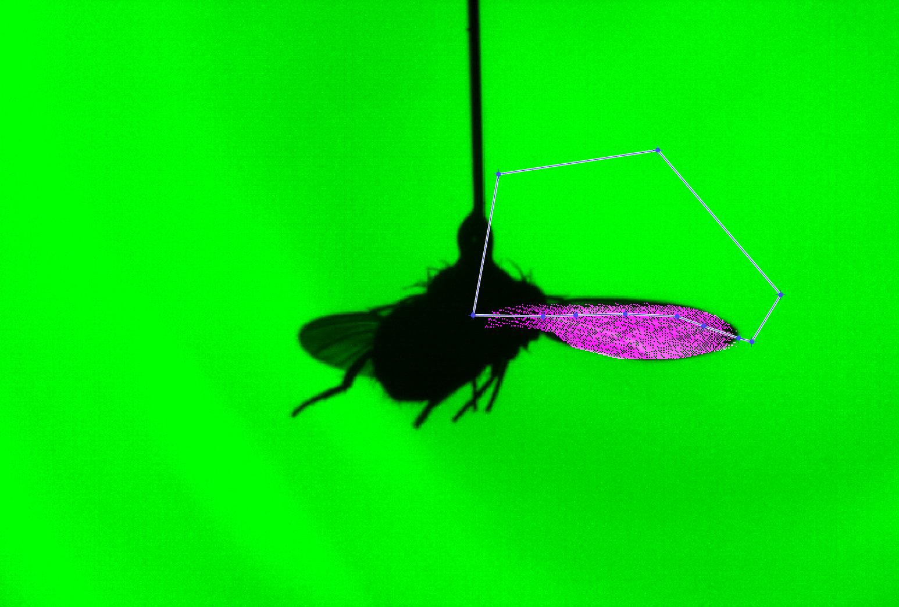   
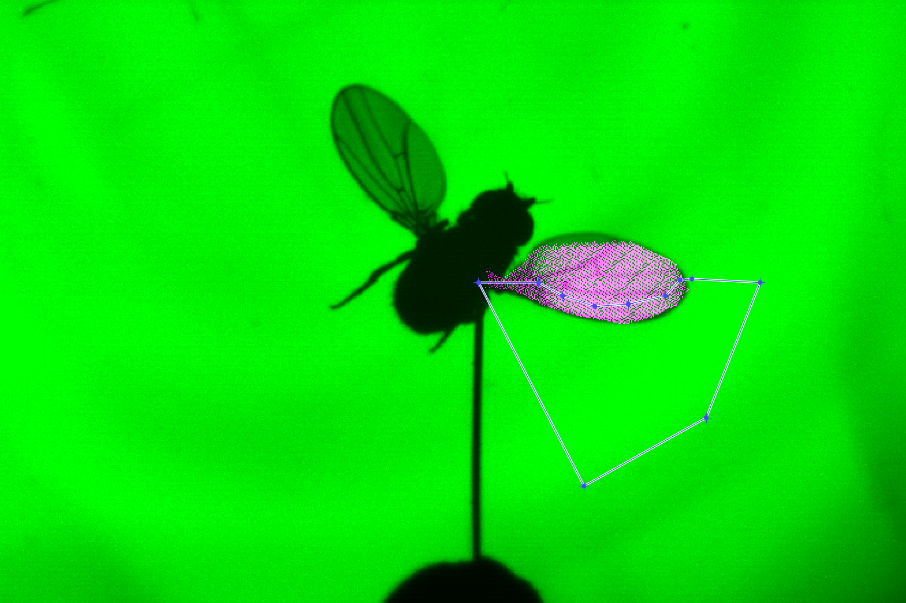   
Select trailing edge: only purple area matters. Trailing edge is the rear edge of a wing. Double click for the next.  
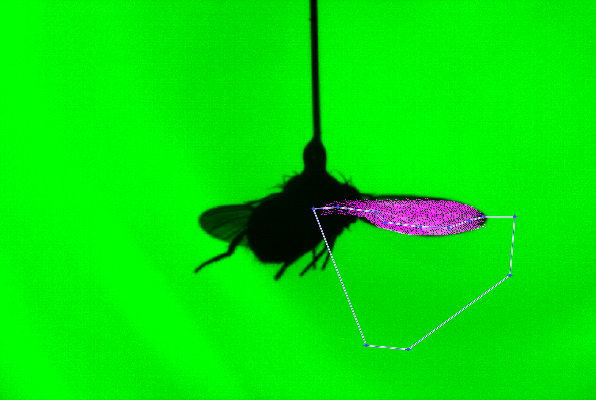   
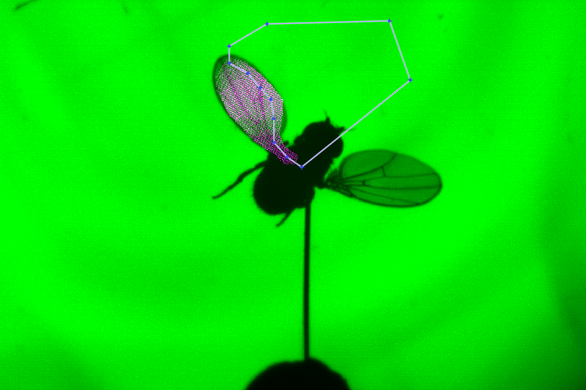  

8. Optional: ```verify reconstruction and correction (just for a visual check, does nothing to change data)```:  
Just for visual check.

9. Run ```align the reconstruction with a global reference frame``` & ```convert the hull coordinates to voxel coordinates```  

10. Under ```Analyze the hull```:  
This function is to check if the solid chord's direction is from the center of the wing to the leading of the wing.  
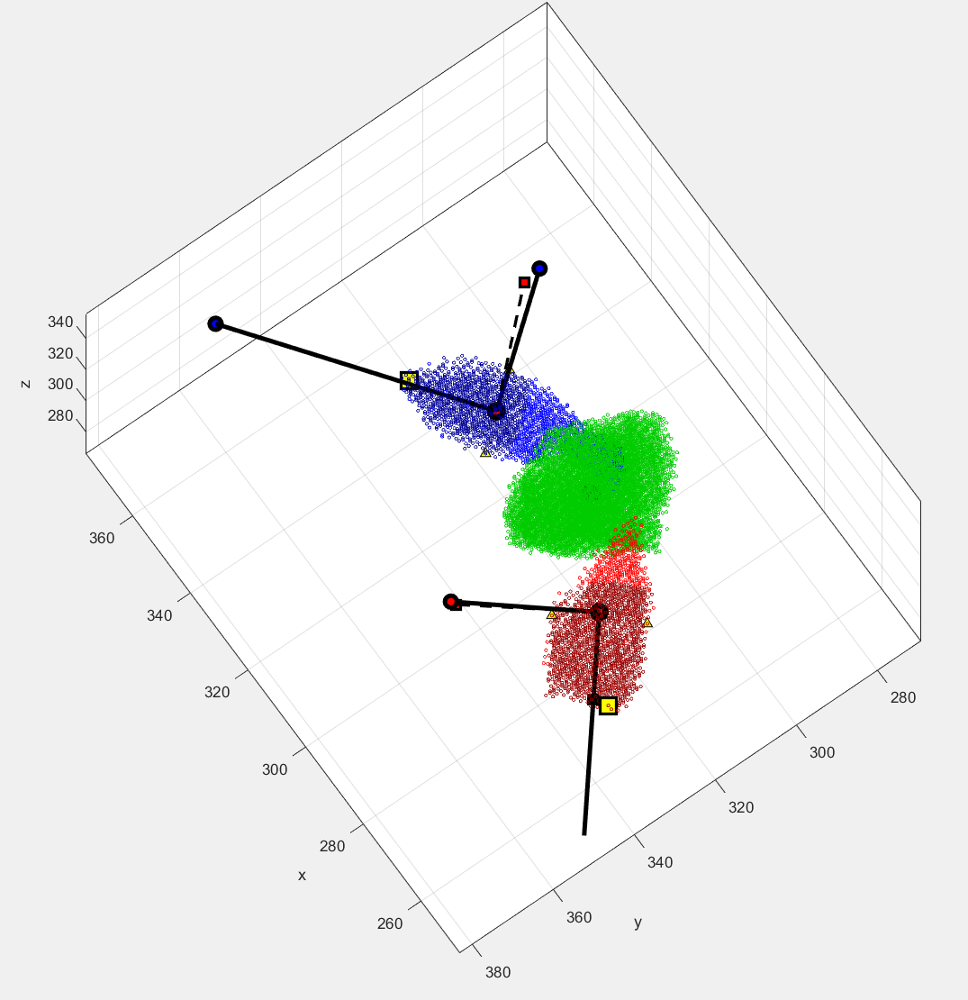  
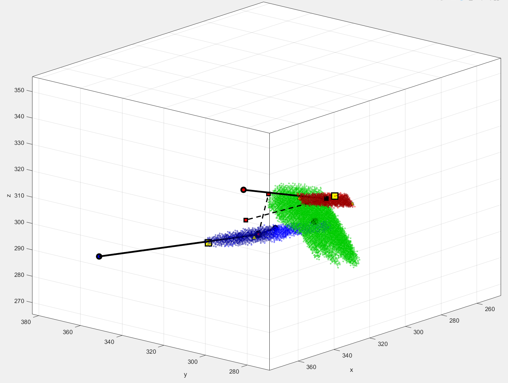  
If it is correct, type '3' and hit 'Enter'.  
If it is not correct: 
a. The chord towards the opposite way: type '1', 'enter', ' then '3', 'enter' if it is corrected.
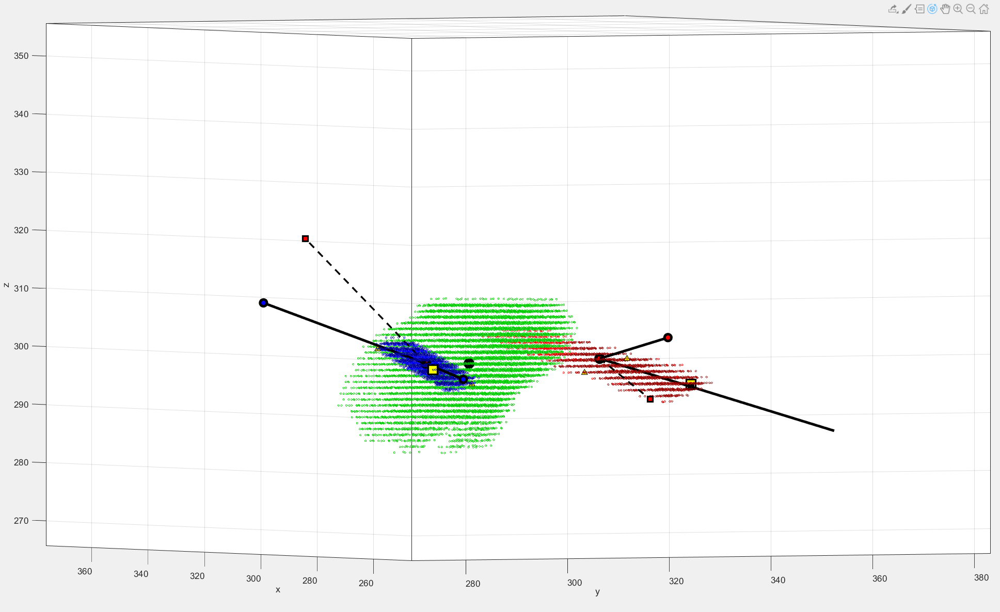  
b. The chord flipped with the alt chord (the dash chord): type '2', 'enter', then '1', 'enter', finally '3', 'enter'
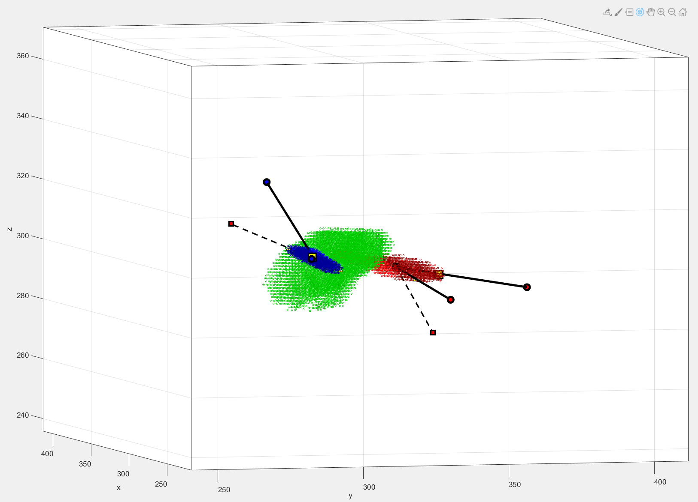  

11. The ```estimates Euler angles``` estimates the stroke, rotation, and deviation angles, and the ```peform angle corrections and filtering``` filters the estimated angles and plot the filtered angles.
